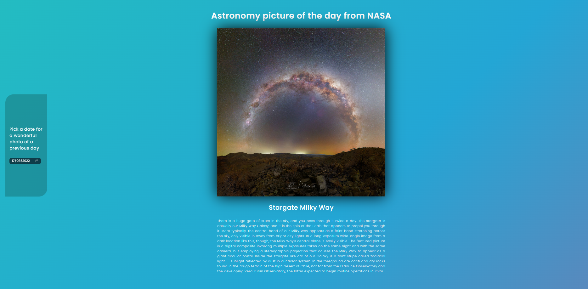

# Picture of the day from NASA

This was a project during my studies to learn and practice
- JS GET request
- get data from an open NASA API

Opening the page will show today's picture from NASA and past ones can also browsed by picking a date on the left panel.

## Usage

1. Clone the project

2. Navigate into *backend* folder
```
cd backend
```

3. Run *server.js*
```
node server.js
```

## Preview
